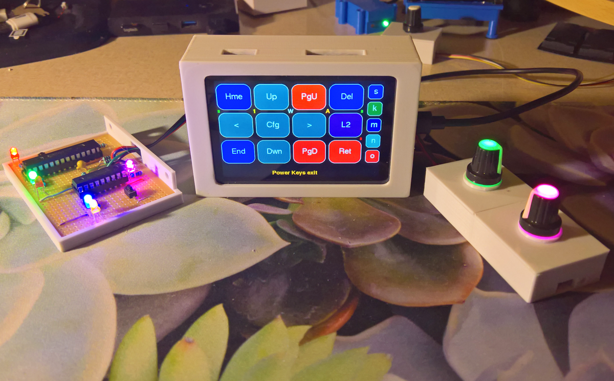
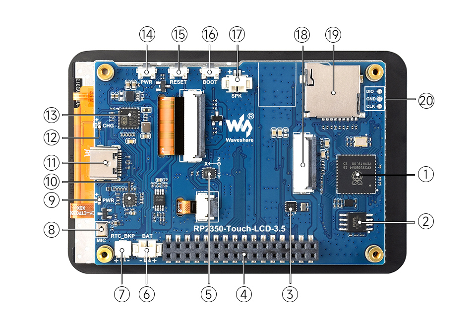
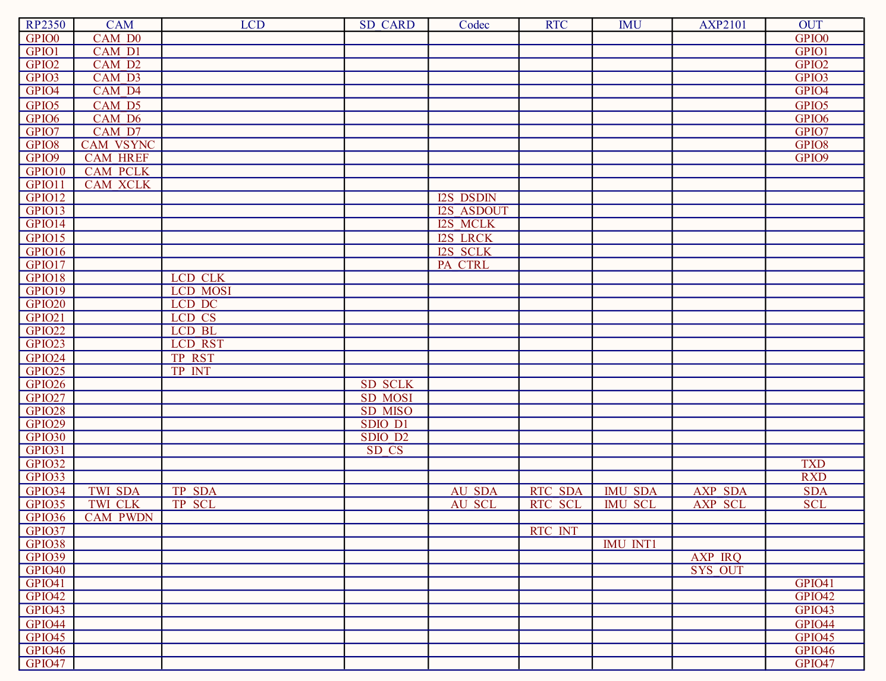
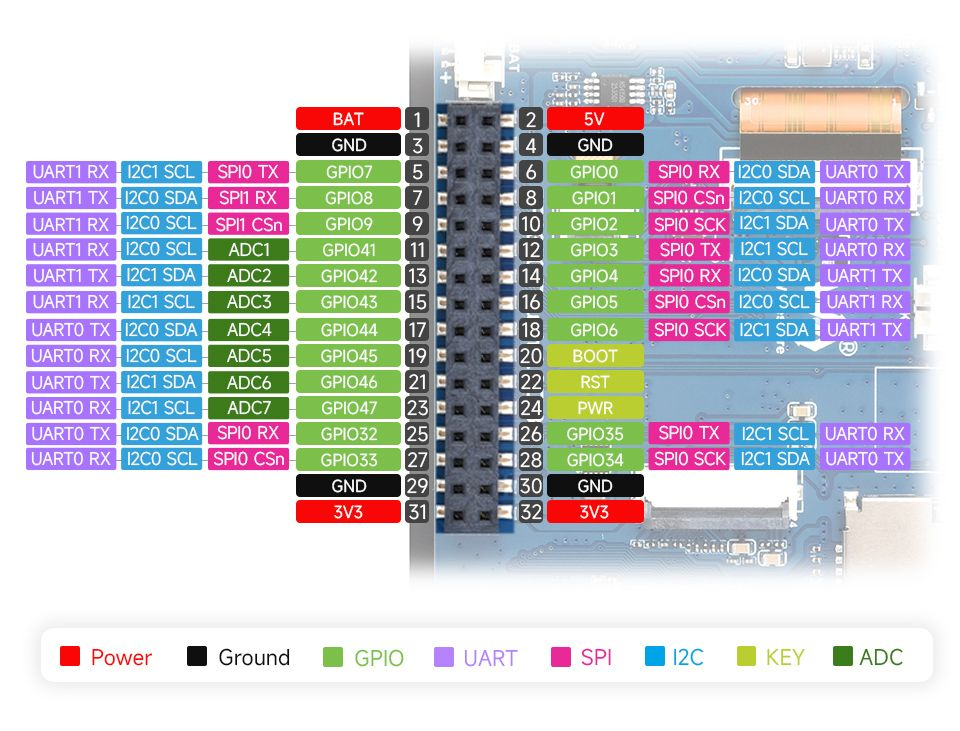
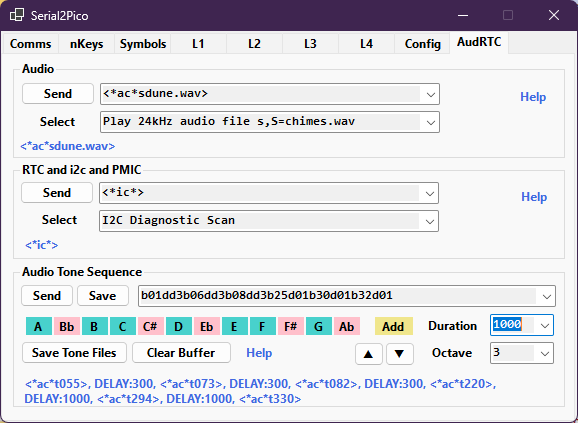
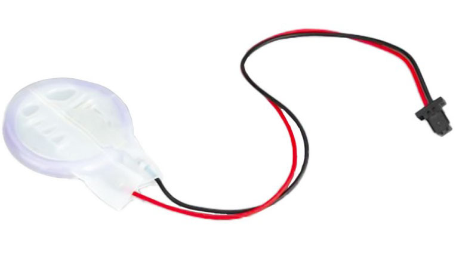

# Raspberry Pi RP2350B Capacitive Touch Macropad

          
         
    
 

     The [**Waveshare RP2350B-A4 FT6336 Capacitive Touch ST7796 LCD 3.5 480x320 with RTC and SDCard module**](https://www.waveshare.com/RP2350-Touch-LCD-3.5.htm) is the device of choice for the Touch Macropad as it costs little more than the similar sized resistive touch version. It requires only a few external libraries and no calibration before use, and is also an IPS panel with good visibility when used lying flat. It has an advanced function power switch for the LCD and expansion socket 3v3 power, and audio and sensor modules. 

 The LCD's ES8311 audio codec can play wav files stored on the SDCard - this is managed as a starcode \*ac\* function and uses the Arduino-Pico i2s libraries, but it does not require any external ES8311 libraries. A collection of suitable 24kHz 16bit mono PCM files are included here: Wav24kHz16bitMono.zip. It handles the *key-held-then-key-repeat function* well which is important when using the two volume keys and also when quickly scrolling through all the starcodes options with the \[*Cm\] key. There is [**more information here**](https://docs.waveshare.com/RP2350-Touch-LCD-3.5?variant=RP2350-Touch-LCD-3.5). The build and source files are in the Pico2A4LCD folder, and the 3DCase files in the 3D-Case folder.  The LCD's integrated **PCF85063A RTC** can use the standard rechargeable Raspberry Pi 5 RTC Panasonic ML-2020 Lithium Manganese Dioxide Battery and the time sync is automatic via the PC App. The **APX2101 PMIC** charges the RTC battery and provides VBus and VSys values with \*ic\*6 and \*ic\*7.

The touchpad can also use the [**Sparkfun Qwiic Twist RGB Rotary Encoder**](https://www.sparkfun.com/sparkfun-qwiic-twist-rgb-rotary-encoder-breakout.html) which means there are two groups of i2c devices attached to the RP2350B - the internal group on the i2c1 bus includes the FT6336 touch controller, the ES8331 audio codec, the RTC chip, the PMIC, and the external devices on the i2c0 bus such as the Twist encoder and the GPIO expanders. 

