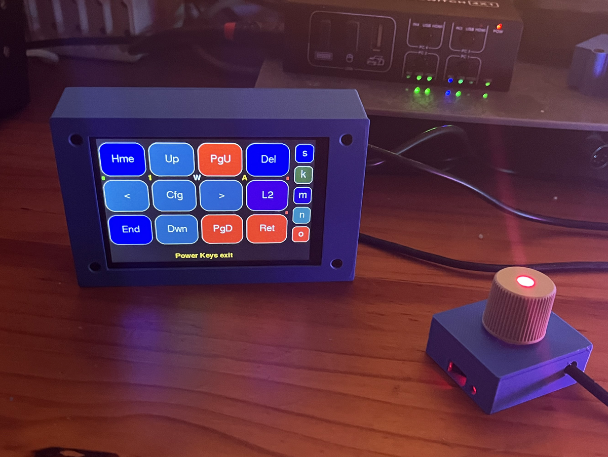
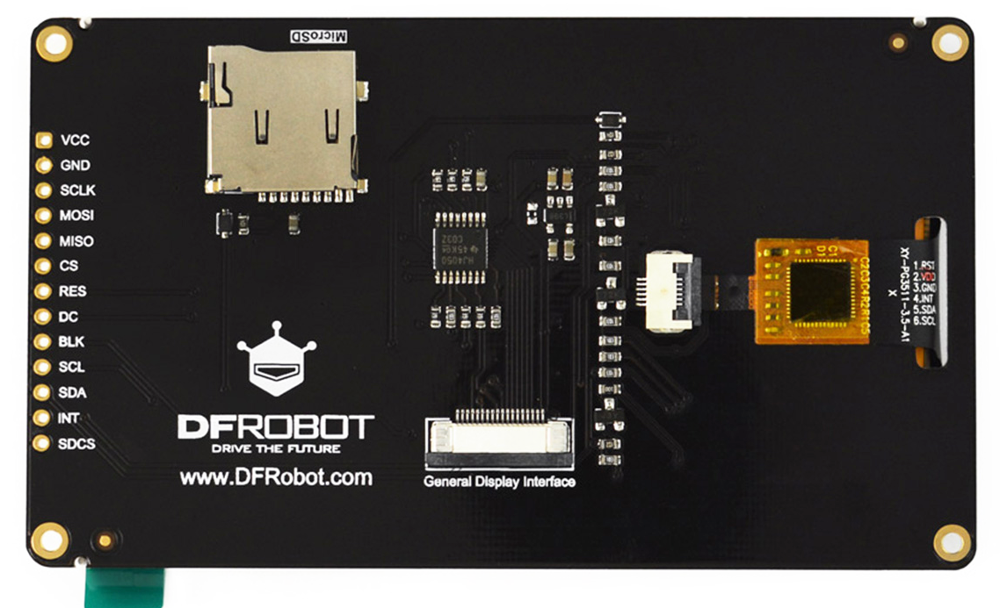

# Raspberry Pi Pico 1 Capacitive Touch Macropad GT911 ILI9488 LCD

<p align="left">
          

</p>

The [**Pico 1 RP2040**](https://www.raspberrypi.org/products/raspberry-pi-pico/) is used with a DFRobot 3.5" capacitive touch LCD - namely the [**DFRobot Fermion Display DFR0669**](https://www.dfrobot.com/product-2107.html). It is a 3.5-inch IPS display with a resolution of 480x320 pixels and capacitive touch using the GT911 touch chip. The module uses the ILI9488 driver chip and communicates via a 4-wire SPI interface. It also features a "General Display Interface" (GDI) for direct connection to compatible controllers. The board includes an onboard MicroSD card slot for storage and operates on a voltage of 3.3V to 5.5V. The Pico 1 handles the shared SDCard and LCD SPI driver well, and allows it to operate at the maximum speed. Earlier the Pico 2 was tried but it was the problematic A2 stepping version, and therefore required the SPI read and write speed to be considerably reduced. 

The standard (Bodmer) TFT_eSPI library was used with the addition of a modified [**GT911 library**](https://github.com/TAMCTec/gt911-arduino).

A 3D-case is provided in two sections - front and back, and prototyping stripboard was used for the construction. The Pico 1 used the same connection pins as the resistive touch Waveshare LCDs originally used for the macropad. The connection details can be found in the (Bodmer) TFT_eSPI configuration files and in the main source code file for each Pico type.  The details are also listed here at the bottom.

No calibration is required for the GT911 library used.


```
Pico 1
#define ILI9488_DRIVER
#define TFT_INVERSION_OFF
#define TFT_BL   13             
#define TFT_BACKLIGHT_ON HIGH  
#define TFT_MISO 12
#define TFT_MOSI 11
#define TFT_SCLK 10
#define TFT_CS   9     
#define TFT_DC   8     
#define TFT_RST  15    
#define SPI_FREQUENCY  20000000
#define SPI_READ_FREQUENCY  8000000

#define TOUCH_SDA 26 
#define TOUCH_SCL 27 
const int pinSdCs = 22;  
const int pinSdClk = 10;
const int pinSdMosi = 11;
const int pinSdMiso = 12; 
pinMode(9, OUTPUT); digitalWrite(9, HIGH);   // TFT CS
pinMode(22, OUTPUT); digitalWrite(22, HIGH); // SD CS
SPI1.setSCK(pinSdClk);
SPI1.setTX(pinSdMosi);
SPI1.setRX(pinSdMiso);
Wire1.setSDA(TOUCH_SDA);       
Wire1.setSCL(TOUCH_SCL);

```


