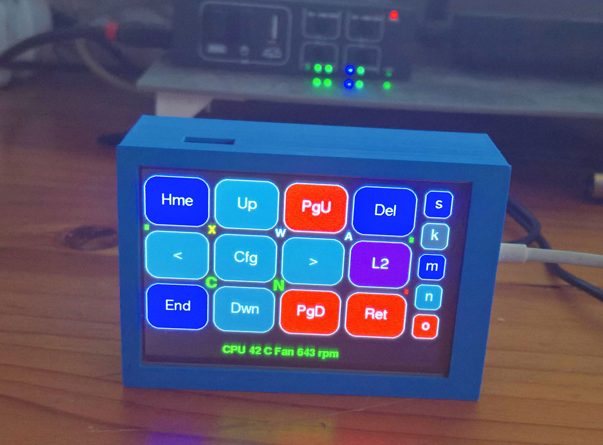
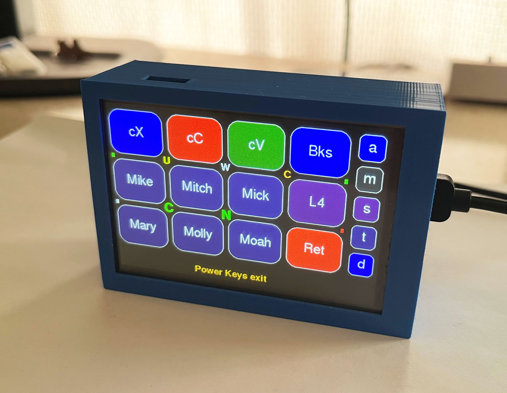
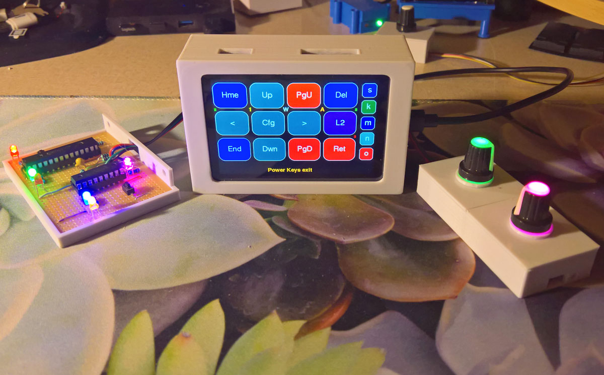
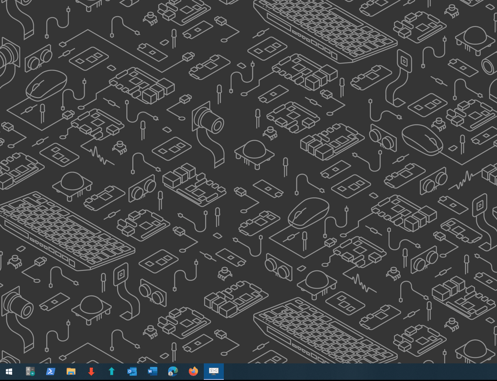
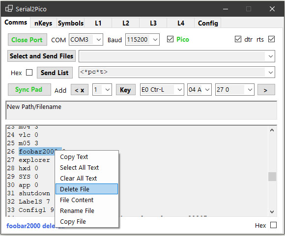
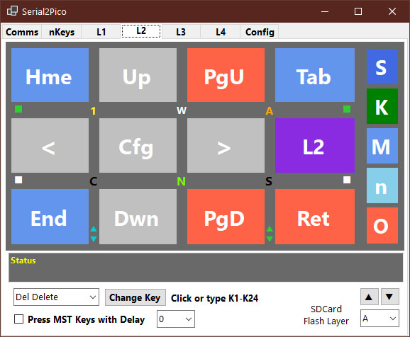
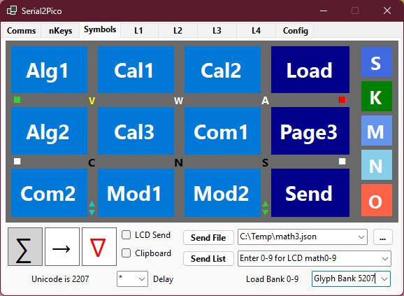

# Raspberry Pi Pico 1 (RP2040) and Pico 2 (RP2350A and RP2350B) Capacitive and Resistive Touch Macropads

 
 
  
 

 
 
  
   

The [**Pico 1 RP2040**](https://www.raspberrypi.org/products/raspberry-pi-pico/), the [**Pico 2 RP2350**](https://www.raspberrypi.com/products/raspberry-pi-pico-2/), the [**Waveshare RP2350 Plus**](https://www.waveshare.com/rp2350-plus.htm?sku=29761), and the [**Waveshare RP2350B**](https://www.waveshare.com/RP2350-Touch-LCD-3.5.htm), in combination with 12 different capacitive-and resistive-touch LCDs, are used as a **File-and-Folder-centric Touch LCD MacroPad** - where everything that the macropad is using are files and folders, located on an SDCard and Flash memory. 

[**Capacitive Touch LCD Macropads**](/Capacitive-Touch-LCD) Two capacitive touch macropads, using FT6336 + ST7796 and GT911 + ILI9488 touch-controller + LCD combinations, have been constructed. Further development will focus on the Waveshare RP2350B + FT6336 + ST7796 LCD. Build files details and source files are available in the [**Capacitive-Touch-LCD folder**](/Capacitive-Touch-LCD). 

[**Resistive Touch LCD Macropads**](/Resistive-Touch-LCD) More than ten different Pico 1 and 2 + resistive touch LCDs have been constructed. Further development will focus on the Waveshare resistive touch LCD XPT2046 + ILI9488 LCD in combination with a Pico 2 or a Waveshare RP2350 Plus. Build file details and source files are available in the [**Resistive-Touch-LCD folder**](/Resistive-Touch-LCD).

A PC Windows-based file manipulation and configuration tool for the Pico Touch LCD with auto-app switching based on process name and window title, is included in the folder [**Serial2PicoApp**](/Serial2PicoApp). Note that after unzipping the app, running the executable the first time will download and install .NET10 run-time files. Pressing keys on the PC app can either press the same key on the TouchLCD, which then through USB HID, send the keypress back to the PC, or execute many of the actions directly from the PC App itself. Start the app by selecting the Pico COM port, then press Open port, press ok twice for the JSON MathSets, open the Config Tab and browse to the location where the apprules.json and Math0 and Math1-9 JSON symbol sets are located, and select one of the mathset.json files. Also make sure the start and end markers are correct for your macropad (to use hex values enter for example 0x02 and 0x03, and then change) - and then close and reopen the App. Pressing [Open Port] should then load the Pico's current configuration into the app. After this first start it will remember the COM port and Math location used, and it will then automatically load this configuration when the Open port button is pressed. 

